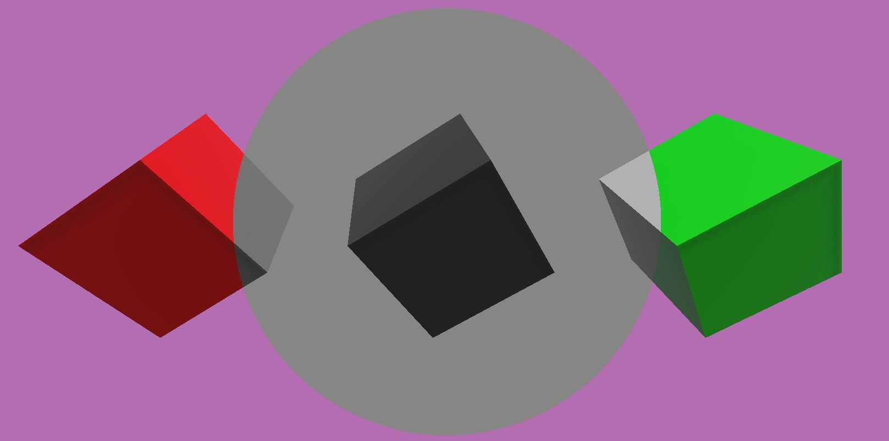
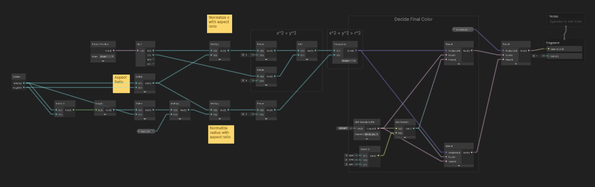

# Unity Shader Graph Examples

According to [documentation]( https://docs.unity3d.com/Packages/com.unity.shadergraph@17.0/manual/index.html), Shader Graph enables developers to build shaders visually. Instead of writing code, developers create and connect nodes in a graph framework.

This repository includes a couple of specific example cases of Shader Graph such as custom post processing, custom HLSL functions and shaders for UI.

## Example Cases

**Custom HLSL Functions:** Shader Graphs enables developers to add custom HLSL functions to graphs as nodes. Using graphs creates a visual experience for developing, however sometimes it can be exhausting, because you may need tens of nodes to be able to create simple shaders. Also, built-in nodes cannot be enough for purposes. In those cases, adding custom functions is very useful. This example case provides a basic custom function which animates the color in a sinusoidal form.

**Custom Post Processing:** Newer Shader Graph versions (URP 14.0+) have the ability of creating shaders for custom post processing. This example provides a custom post processing shader which converts screen into grayscale colors with a circular animation.

**Shader Graph for UI (Newer Versions):** Newer Shader Graph versions (URP 16.0+) can create canvas shaders to use for UI. This example case includes a basic canvas shader which blends two textures with an adjustable border.

**Shader Graph for UI (Older Versions):** It provides an example UI shader which is based on sprite unlite shaders for older versions.

